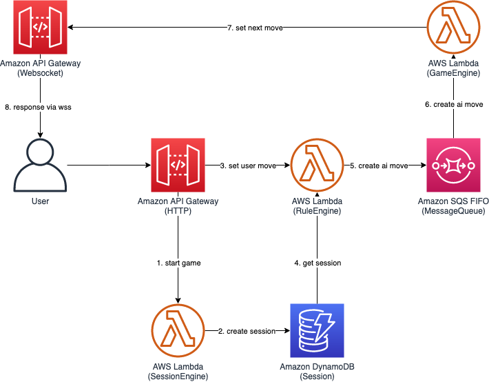
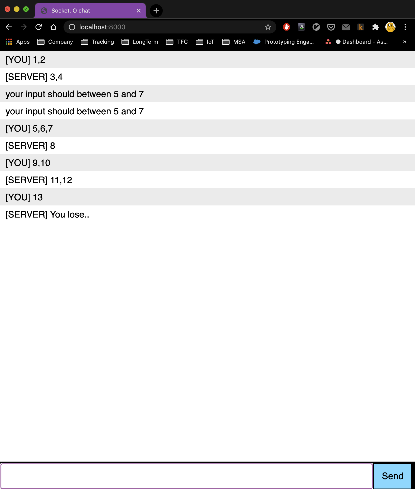

# Serverless Event-driven backend Workshop

This workshop shows you how to build serverless application based on event-driven backend.
You will learn how to communicate one Lambda to another in asynchronously using SQS,
and how to push server response to client via Websocket API Gateway.

Deploying the CDK project provisions below infrastructure on your AWS account



This application implmented a popular game in Korea, named `13`(a.k.a Baskin Robbins).
It is a counting game where everyone(you and server) can count up to three numbers.
The goal of the game is not to count `13`. If you count `13`, you lose.
You start with one, and can stop counting one, two or three.
Then, the server will count up to three numbers starting where the you left off. 

> BTW, you can not win against to server by design

# Prerequisites

- NodeJs 12.x+
- awscli
- AWS Account and locally configured AWS credential

If you run this workshop on **Cloud9 IDE**, skip Installation section

# Installation

Install NodeJs, [**official installation guide**](https://nodejs.org/ko/download/)

Install awcli

```bash
$ pip install awscli
$ aws --version
aws-cli/1.18.181 Python/3.7.4 Darwin/19.6.0 botocore/1.19.21
```

Configure awscli

```bash
$ aws configure
AWS Access Key ID [****************MT6L]: 
AWS Secret Access Key [****************yX2F]: 
Default region name [ap-northeast-2]: 
Default output format [json]:
```

## Provision Infrastructure

Install project dependencies

```bash
$ cd infra
$ npm i
```

Install `cdk` and `esbuild` on global context,

```bash
$ npm i -g cdk@1.76.0 esbuild
```

Run `cdk bootstrap` if this is first time to use CDK on your account.
And deploy infrastructure

```bash
$ cdk bootstrap
$ cdk deploy "*" --require-approval never
```

# Usage

1. Connect to websocket and get `connectionID`
2. Start new game sesison using invoke HTTP API Gateway at `POST /start`
3. Count your numbers via `POST /game`
4. Check out server response on websocket
5. do 3~4 until **you** count 13.
## Websocket API Gateway

Get endpoint url for Websocket API Gateway

```bash
$ export WS_ENDPOINT=$(aws cloudformation describe-stacks --stack-name ServerlessWorkshopInfraStack --query "Stacks[0].Outputs[?ExportName=='WsApiUrl'].OutputValue" --output text)
$ echo $WS_ENDPOINT
wss://xxx.execute-api.ap-northeast-2.amazonaws.com/dev
```

Install `wscat` for connecting websocket endpoint

```bash
$ npm i -g wscat
```

Connect to endpoint using wscat.

```bash
$ wscat -c $WS_ENDPOINT
Connected (press CTRL+C to quit)
> hi
< {"message": "Forbidden", "connectionId":"XDmENcnwIE0CFEQ=", "requestId":"XDmGEE2RoE0FRdQ="}
```

Copy this `connectionId`, in this case it's *XDmENcnwIE0CFEQ=*, to your clipboard.
And keep open the terminal to get response from the server on next step.

## Http API Gateway

Open new terminal.

Install [**httpie**](https://httpie.io/), it's human friendly versino of *curl*.

```bash
# On MacOS
$ brew install httpie

# On Linux
$ sudo apt install httpie

# On Amazon Linux2
$ sudo yum install httpie
```

Get HTTP API Gateway url

```bash
$ export HTTP_ENDPOINT=$(aws cloudformation describe-stacks --stack-name ServerlessWorkshopInfraStack --query "Stacks[0].Outputs[?ExportName=='HttpApiUrl'].OutputValue" --output text)
$ echo $HTTP_ENDPOINT
https://xxxx.execute-api.ap-northeast-2.amazonaws.com/dev
```

Start game session using connectionId and arbitrary accountId.

```bash
$ export CONN_ID=CONNECTION_ID_YOU_COPIED   # e.g. XDqRFclbIE0CJPw=
$ http post $HTTP_ENDPOINT/start sessionId=$CONN_ID accountId=1
```

Count your numbers via `POST /game`

```bash
$ http post $HTTP_ENDPOINT/game sessionId=$CONN_ID accountId=1 userMove=1,2

HTTP/1.1 200 OK
Apigw-Requestid: XDqYKi2WoE0EPdg=
Connection: keep-alive
Content-Length: 45
Content-Type: text/plain; charset=utf-8
Date: Sat, 05 Dec 2020 02:31:30 GMT
{
    "lastMove": 2,
    "sessionId": "XDqRFclbIE0CJPw="
}
```

Check out websocket

```bash
> hi
< {"message": "Forbidden", "connectionId":"XDqRFclbIE0CJPw=", "requestId":"XDqROEJuoE0FpCQ="}
< {"data":"3,4"}
```

Continue game to the end, your websocket terminal would goes like this..

```bash
> hi
< {"message": "Forbidden", "connectionId":"XEEuXcgPoE0Acmw=", "requestId":"XEFD0E2foE0Fpgg="}
< {"data":"3,4"}
< {"data":"7,8"}
< {"data":"10,11,12"}
< {"data":"You lose.."}
```

## Check out on webpage

Open [**index.html**](public/index.html) and modify `wsUrl` and `httpUrl` variables.

Run simple http server to serve *index.html*

```bash
$ cd ../public
$ python -m http.server 8080
```

Open `http://localhost:8080` on web browser



# Cleanup

Destroy resources from your account

```bash
$ cdk destroy "*"
```